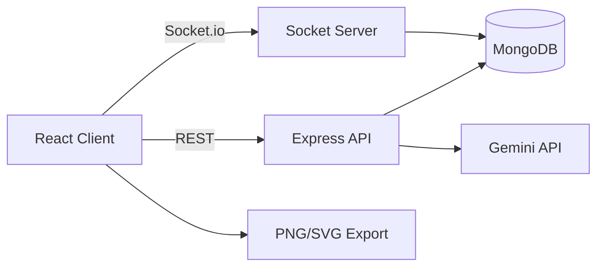

# Synapse

Synapse is a premium real-time system architecture designer built with React, Node.js, Express, MongoDB, Socket.io, JWT authentication, and Docker. It started as a MERN canvas prototype and has been expanded phase by phase into a secure, multi-tenant, AI-assisted, multiplayer architecture workspace with live presence, realtime cursors, export tooling, infrastructure compilation, and production-ready local container orchestration.

This README reflects the current shipped state of the project through Phase 11.

## What Synapse Does Today

Synapse currently supports all of the following in one integrated workflow:

- Secure account creation and login with JWT authentication.
- Multi-tenant canvas storage so each user can only access their own canvases.
- A premium dashboard for creating, listing, opening, and deleting architecture canvases.
- A live editor for building software architecture graphs with draggable nodes and visual SVG edges.
- Small, medium, and large node card sizing controls.
- Realtime multi-user node movement and canvas synchronization with Socket.io.
- Live collaboration presence badges showing everyone currently in the same canvas.
- Figma-style realtime remote cursors with name tags and idle cleanup.
- AI-assisted architecture mutations using Gemini with controller-level local fallback behavior.
- Infrastructure generation from the current graph model.
- Export of the rendered diagram as PNG or SVG.
- Unified Docker-based local startup for database, API, and client.

## Completed Build Phases

### Phase 1: Foundation

The project began as a client/server monorepo with a React frontend, Express backend, MongoDB persistence, and a health-check route. This phase established the workspace structure, database connectivity, environment handling, and the original canvas schema.

### Phase 2: Canvas CRUD

Canvas creation, retrieval, and updating were added on the backend. MongoDB became the source of truth for the architecture graph so the editor could load and save real persisted canvases instead of remaining a browser-only prototype.

### Phase 3: Interactive Editor UI

The React client was expanded into a polished architecture workspace with Tailwind styling, draggable nodes, a premium visual layout, and a sidebar for composing frontend, API, database, and cache layers.

### Phase 4: Realtime Collaboration Base

Socket.io was wired into both the client and server to synchronize graph interactions. SVG-based edge rendering was added so relationships between nodes are visually represented with measured DOM anchors rather than fixed coordinates.

### Phase 5: Deletion and Compilation

Node deletion, edge deletion, and infrastructure generation were added. The graph can now be compiled into infrastructure output, giving the workspace a concrete engineering artifact beyond the visual canvas.

### Phase 6: Hardening and Dockerization

The app was containerized with Docker and `docker compose`, adding a MongoDB service, API container, and nginx-served frontend container. Health checks, reconnect behavior, production-like routing, and runtime safety improvements were introduced so the entire stack can be spun up locally with a single command.

### Phase 7: AI Copilot Foundations

An AI drawer was added to the editor so plain-English commands can mutate the graph. The user can ask Synapse to add nodes or connect components without manually performing every canvas operation.

### Phase 8: Live Gemini Integration and Fallback

The AI layer was upgraded from temporary regex handling to a real Gemini-backed planner with structured action responses. Controller-level fallback logic was also added so graph mutation testing remains possible even during model quota or service failures.

### Phase 9: Multi-Canvas Dashboard and Export

The client was split into a dashboard/editor flow. A new dashboard route lists all canvases as polished visual cards, supports create/delete operations, and routes into the editor. The editor gained rendered diagram export as PNG and SVG, and node cards gained explicit size presets.

### Phase 10: JWT Authentication and Multi-Tenancy

Authentication was added end to end with JWT and bcryptjs. A `User` model now stores account identity, passwords are hashed, auth routes issue signed tokens, and all protected canvas routes are owner-scoped. The client now has login/signup views, auth state, protected route gating, and token-aware HTTP and socket behavior.

### Phase 11: Presence and Realtime Cursors

Synapse now exposes live multiplayer presence inside each canvas room. The editor header shows overlapping avatar badges for every active collaborator, and the canvas displays custom remote cursors with floating name tags. These cursors are throttled for performance and removed automatically after inactivity.

## Tech Stack

### Frontend

- React 18
- Vite 5
- Tailwind CSS 3
- Socket.io client
- `html-to-image` for diagram export
- Lucide React for the visual icon system

### Backend

- Node.js
- Express 4
- MongoDB with Mongoose 8
- Socket.io 4
- `bcryptjs` for password hashing
- `jsonwebtoken` for JWT issuance and verification
- Helmet and CORS for API hardening
- Gemini SDK for AI graph planning

### DevOps and Runtime

- Docker
- Docker Compose
- nginx for the production-style client container
- MongoDB container for local orchestration

## High-Level Architecture



### Client Responsibilities

The React client handles route gating, dashboard navigation, canvas editing, export, local editor state, AI command input, avatar presence rendering, and realtime cursor overlays.

### API Responsibilities

The Express API handles authentication, canvas CRUD, infrastructure generation, AI graph mutation planning and fallback, ownership checks, and environment configuration.

### Realtime Responsibilities

The Socket.io layer authenticates each connection with the same JWT used for the REST API, authorizes canvas room joins, broadcasts room presence updates, streams node drag events, syncs canvas state, and forwards collaborator cursor positions.

### Database Responsibilities

MongoDB persists users and canvases. Canvases remain owner-scoped and store the node/edge graph that drives the visual editor, compiler, AI mutation path, and export functionality.

## Core Features in Detail

### 1. Secure Authentication

Synapse now includes full account auth with:

- User registration via `/api/auth/register`
- User login via `/api/auth/login`
- bcryptjs password hashing before persistence
- Signed JWT tokens returned after successful auth
- Token-aware API requests using the `Authorization: Bearer <token>` header
- Token-aware Socket.io authentication via handshake auth
- Client-side session persistence and logout clearing

### 2. True Multi-Tenant Canvas Ownership

All canvas operations are protected by auth middleware. This means:

- Users only see their own canvases on the dashboard.
- Users cannot open another user's canvas by guessing or pasting its ID.
- Users cannot update, delete, or AI-mutate another user's graph.
- Socket room access is also owner-checked before joining a canvas room.

### 3. Dashboard Workflow

The dashboard is no longer a placeholder. It supports:

- Listing every canvas owned by the signed-in user
- Showing card-level metadata such as node count, edge count, stack tags, and last modified time
- Creating a new blank canvas
- Opening any saved canvas in the editor route
- Deleting canvases directly from the dashboard
- Redirecting unauthenticated visitors to login before any canvas metadata is shown

### 4. Graph Editing

The editor supports:

- Draggable architecture nodes
- SVG edge rendering between node anchors
- Click-to-connect node wiring
- Edge deletion
- Node deletion with connected-edge cleanup
- Node size changes between small, medium, and large presets
- Persistent save to MongoDB

### 5. Realtime Collaboration

Realtime editor behavior includes:

- Room-based collaboration using the canvas ID as the Socket.io room key
- Live node drag synchronization between sessions
- Live canvas update broadcasts for saved graph changes
- Presence tracking per active socket session
- Overlapping live editor avatars in the header
- Realtime remote cursors with user color, initials, and name label
- Automatic cursor cleanup after 5 seconds of inactivity

### 6. AI Copilot

The AI system is integrated into the editor as a mutation-only copilot. It currently focuses on architecture graph actions such as adding nodes and creating connections. The implementation includes:

- Gemini-based planning using structured responses
- Plain-English architecture mutation requests
- Controller-side fallback logic for local testing when Gemini fails
- Conversational short-circuit behavior for non-architecture requests
- Reuse of the same persistence and socket broadcast path as manual edits

### 7. Infrastructure Output

The editor can compile the current graph into infrastructure-oriented output. This keeps Synapse grounded as an engineering tool rather than only a visual diagramming product.

### 8. Diagram Export

The rendered canvas can be exported as:

- PNG for high-resolution image sharing
- SVG for scalable vector output

Export captures the actual rendered canvas surface, including cards and SVG edges.

## Repository Structure

```text
Synapse/
|-- client/
|   |-- Dockerfile
|   |-- index.html
|   |-- nginx.conf
|   |-- package.json
|   |-- postcss.config.js
|   |-- tailwind.config.js
|   |-- vite.config.js
|   `-- src/
|       |-- App.jsx
|       |-- WorkspaceApp.jsx
|       |-- index.css
|       |-- main.jsx
|       |-- components/
|       |   |-- AIDrawer.jsx
|       |   |-- DashboardView.jsx
|       |   |-- EdgeOverlay.jsx
|       |   |-- InfraModal.jsx
|       |   |-- Login.jsx
|       |   |-- Signup.jsx
|       |   `-- workspace/
|       |       |-- AvatarPresenceGroup.jsx
|       |       |-- Canvas.jsx
|       |       |-- Node.jsx
|       |       `-- Sidebar.jsx
|       |-- context/
|       |   `-- AuthContext.jsx
|       |-- services/
|       |   |-- api.js
|       |   `-- socket.js
|       `-- utils/
|           |-- createRafThrottle.js
|           `-- presenceAppearance.js
|-- server/
|   |-- .env.example
|   |-- Dockerfile
|   |-- package.json
|   `-- src/
|       |-- app.js
|       |-- index.js
|       |-- config/
|       |   |-- db.js
|       |   `-- env.js
|       |-- controllers/
|       |   |-- authController.js
|       |   `-- canvasController.js
|       |-- middleware/
|       |   `-- auth.js
|       |-- models/
|       |   |-- Canvas.js
|       |   `-- User.js
|       |-- routes/
|       |   |-- authRoutes.js
|       |   |-- canvasRoutes.js
|       |   `-- health.routes.js
|       |-- services/
|       |   `-- infrastructureCompiler.js
|       |-- socket/
|       |   `-- registerCanvasSocket.js
|       `-- utils/
|           |-- aiParser.js
|           `-- authToken.js
|-- docker-compose.yml
|-- package.json
|-- package-lock.json
`-- test-api.sh
```

## Data Model

### User Schema

Users are stored with the following fields:

- `name`: display name used in the UI and presence system
- `email`: unique account identity
- `password`: bcrypt-hashed password stored as a non-selected field by default

### Canvas Schema

Each canvas stores:

- `title`: human-readable canvas name
- `owner`: the authenticated user who owns the canvas
- `nodes`: graph nodes with `id`, `type`, `position`, and `data`
- `edges`: graph connections with `id`, `source`, and `target`
- `lastModified`: Mongoose-managed timestamp

### Node Shape

Each node carries:

- `id`: client-generated stable node identifier
- `type`: frontend, api, database, cache, or compatible variants
- `position`: `{ x, y }`
- `data.label`: user-facing node name
- `data.techStack`: string array describing the component stack
- `data.size`: `sm`, `md`, or `lg`

## REST API Surface

### Public Routes

| Method | Route | Purpose |
|---|---|---|
| `GET` | `/api/health` | Health check and database status |
| `POST` | `/api/auth/register` | Create account and receive JWT |
| `POST` | `/api/auth/login` | Authenticate and receive JWT |

### Protected Canvas Routes

All routes below require `Authorization: Bearer <token>`.

| Method | Route | Purpose |
|---|---|---|
| `GET` | `/api/canvases` | List canvases owned by the current user |
| `POST` | `/api/canvases` | Create a new blank canvas owned by the current user |
| `GET` | `/api/canvases/:id` | Fetch a single owned canvas |
| `PUT` | `/api/canvases/:id` | Update title, nodes, and/or edges |
| `DELETE` | `/api/canvases/:id` | Delete an owned canvas |
| `POST` | `/api/canvases/:id/ai-command` | Apply AI mutation plan to an owned canvas |
| `POST` | `/api/canvases/:id/generate-infra` | Compile infrastructure output for an owned canvas |

## Socket Events

### Client to Server

| Event | Purpose |
|---|---|
| `join-canvas` / `canvas:join` | Join an authenticated canvas room |
| `node-drag` / `canvas:node:moved` | Broadcast live node movement |
| `canvas-updated` | Broadcast graph/title changes |
| `client-cursor-move` | Broadcast current pointer position on the canvas plane |

### Server to Client

| Event | Purpose |
|---|---|
| `server:ready` | Initial socket readiness |
| `canvas:joined` | Successful room join |
| `canvas:error` | Join/auth/ownership failure |
| `node-drag` | Remote node movement |
| `canvas-updated` | Remote canvas state update |
| `room-presence-updated` | Full room presence list |
| `server-cursor-update` | Remote cursor movement or cursor-leave notification |

## Environment Variables

Create `server/.env` from `server/.env.example`.

```env
PORT=4000
MONGODB_URI=mongodb://127.0.0.1:27017/synapse
CLIENT_ORIGIN=http://localhost:5173
GEMINI_API_KEY=
JWT_SECRET=change-this-in-production
```

### Variable Notes

- `PORT`: API server port.
- `MONGODB_URI`: MongoDB connection string. This can point to local MongoDB or Atlas.
- `CLIENT_ORIGIN`: allowed frontend origin for CORS and Socket.io.
- `GEMINI_API_KEY`: optional but required for live Gemini planning.
- `JWT_SECRET`: required for secure token signing in real environments.

## Local Development Setup

### Prerequisites

- Node.js 20+ recommended
- npm
- MongoDB running locally or a reachable MongoDB Atlas cluster
- Docker Desktop if you want the containerized runtime

### Install Dependencies

From the project root:

```bash
npm install
```

### Configure Environment

```bash
cp server/.env.example server/.env
```

Then fill in the values you need, especially `MONGODB_URI`, `JWT_SECRET`, and optionally `GEMINI_API_KEY`.

### Run in Development Mode

```bash
npm run dev
```

This starts:

- the Vite frontend on `http://localhost:5173`
- the Express API on `http://localhost:4000`

### Useful Workspace Commands

```bash
npm run dev
npm run dev:client
npm run dev:server
npm run build
npm run start
```

## Docker Workflow

### Start Everything

```bash
npm run docker:up
```

or:

```bash
docker compose up --build
```

### Stop Everything

```bash
npm run docker:down
```

or:

```bash
docker compose down
```

### Docker Services

- `synapse-db`: MongoDB container
- `synapse-server`: Express + Socket.io API
- `synapse-client`: nginx-served frontend

### Exposed Ports

- `5173`: client
- `4000`: API

The Docker setup is designed to preserve the same unified `/api` and `/socket.io` frontend integration used during development.

## How to Use Synapse

### Authentication Flow

1. Open Synapse.
2. Create an account or sign in.
3. After auth, you are redirected to the dashboard or the protected route you originally attempted to open.
4. On logout, the stored session is removed and both API/socket auth are cleared.

### Dashboard Flow

1. Review all canvases owned by the signed-in user.
2. Click `New Architecture` to create a blank canvas.
3. Open an existing canvas to continue editing.
4. Delete canvases directly from the dashboard when needed.

### Editor Flow

1. Add nodes from the sidebar.
2. Drag them into position.
3. Start connections between nodes.
4. Resize cards as needed.
5. Save the graph.
6. Generate infrastructure output.
7. Export the diagram as PNG or SVG.

### Collaboration Flow

1. Sign into the same account in two browser sessions.
2. Open the same canvas in both windows.
3. Watch the presence badges in the editor header.
4. Move the mouse over the canvas in one session to see the remote cursor in the other.
5. Drag nodes or save changes to watch live sync behavior.

### AI Flow

1. Open the AI drawer.
2. Ask Synapse to add or connect architecture components in plain English.
3. If Gemini is unavailable, the controller can still use the local fallback path for supported scenarios.

## Security and Ownership Model

Synapse now treats security and tenancy as first-class concerns.

- Only auth routes and health checks are public.
- Every canvas route is protected by JWT auth.
- Every canvas query is owner-scoped.
- Socket joins validate both token authenticity and canvas ownership.
- Unauthenticated users are redirected away from dashboard and editor routes.
- Logout clears client session state and removes active token usage.

## Realtime Presence and Cursor Details

The collaboration layer is optimized for a crisp but lightweight multiplayer feel.

- Presence is tracked in memory per canvas room.
- Presence is keyed by active socket session, not only by user ID, so multiple windows can still show as separate active editors.
- Cursor emissions are throttled on the client to avoid websocket spam.
- Cursor state is removed after 5 seconds of inactivity.
- Disconnects and room leaves trigger immediate presence refresh.

## Export and Compiler Details

### Diagram Export

The export system captures the actual canvas surface as rendered in the editor. This includes:

- node cards
- SVG edges
- the current visual layout

### Infrastructure Compilation

The infrastructure compiler turns the graph into output derived from the current canvas state. This lets the diagram act as a working design artifact rather than remaining a static picture.

## AI Implementation Notes

The AI system is intentionally focused on graph mutation instead of open-ended chat. That keeps the feature aligned with the purpose of the product: modifying architecture state.

The current AI stack includes:

- Gemini structured response planning
- local controller fallback logic
- node placement helpers
- duplicate prevention for nodes and edges
- strict mutation application through the same persistence path as manual edits

## Suggested Verification Checklist

Use this checklist after changes or before demos:

1. Confirm `http://localhost:4000/api/health` returns `ok`.
2. Confirm unauthenticated visits to `/dashboard` redirect to `/login`.
3. Confirm signup/login succeeds and dashboard loads user-owned canvases only.
4. Confirm creating, opening, saving, and deleting a canvas works.
5. Confirm realtime node dragging syncs across two sessions.
6. Confirm presence badges show multiple active sessions.
7. Confirm remote cursors render and disappear after idle timeout.
8. Confirm PNG and SVG export download successfully.
9. Confirm AI mutations work when Gemini is available and supported fallback still works when Gemini is unavailable.
10. Confirm Docker startup serves the full stack successfully.

## Project Status Summary

Synapse is no longer just a starter MERN canvas. It is now a secure, collaborative, exportable, AI-assisted architecture workspace with:

- JWT auth
- multi-tenant persistence
- room-based realtime collaboration
- presence badges
- remote cursors
- dashboard/editor route split
- export tooling
- infrastructure compilation
- Dockerized local runtime

It is in strong portfolio/demo shape and already supports realistic collaborative system design workflows.
